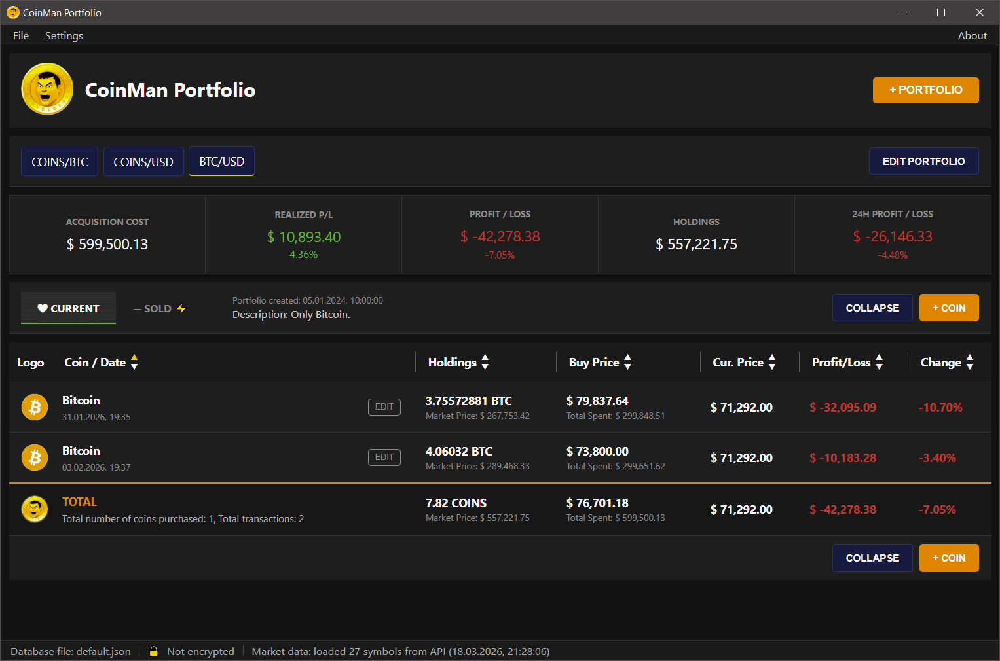
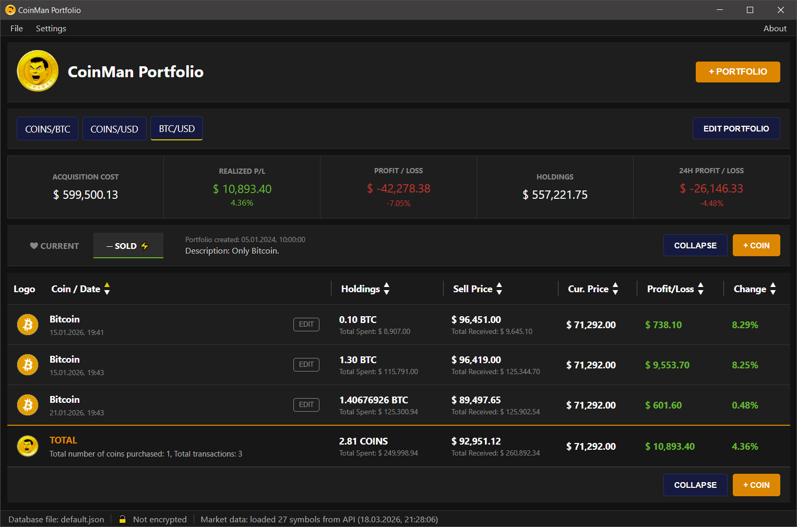

# CoinMan Portfolio Tracker

A simple desktop application for tracking and managing your cryptocurrency portfolio. All data is stored **locally on your hard drive** — no cloud, no servers, no registration required.

---

## Why CoinMan?

Most portfolio tracking services store your data on their servers, where third parties can potentially access it. CoinMan Portfolio Tracker works differently: all information about your coins, transactions, and amounts stays exclusively on your machine in a plain JSON file.

- **Privacy first** — nobody knows what you hold
- **No registration** — no account, no email, no phone number
- **Works offline** — prices are fetched on demand, not required
- **Open source** — verify exactly what the app does

---

## Features

- Multiple independent portfolios within a single database file
- Add coins with buy price, amount, date, and notes
- Record sells and track realized profit/loss
- Automatic current price fetching via [CoinGecko API](https://www.coingecko.com/) or [CoinMarketCap API](https://coinmarketcap.com/) (configurable)
- P&L display and price change in %
- Switch between multiple database files at runtime
- **AES-256-GCM database encryption** with Argon2id key derivation
- Optional "Current Price" column (toggle in Settings)
- Status bar: loaded database name + market data status
- Debug logging to file (launch with `--debug` flag)
- Window size and position saved between launches

---

## Supported Platforms

| Platform | Status |
|----------|--------|
| Windows 10/11 | ✅ Supported |
| Linux (Ubuntu 22.04+) | ✅ Supported |
| macOS | ✅ Supported |

---

## Screenshots





---

## Building from Source

### Prerequisites

**All platforms:**
- [Rust](https://rustup.rs/) (1.77.2 or newer)
- [Node.js](https://nodejs.org/) (v18+) — required by Tauri CLI only
- Tauri CLI:
  ```bash
  cargo install tauri-cli --version "^2"
  ```

**Linux (Ubuntu/Debian) only:**
```bash
sudo apt update
sudo apt install -y \
  libwebkit2gtk-4.1-dev \
  libssl-dev \
  libgtk-3-dev \
  libayatana-appindicator3-dev \
  librsvg2-dev \
  patchelf
```

**Windows only:**
- [WebView2 Runtime](https://developer.microsoft.com/en-us/microsoft-edge/webview2/) (already bundled in Windows 11)
- [Visual Studio Build Tools](https://visualstudio.microsoft.com/visual-cpp-build-tools/) with the **Desktop development with C++** workload

---

### Development mode

```bash
git clone https://github.com/coinman-dev/portfolio.git
cd portfolio
cargo tauri dev
```

---

### Building portable binaries (no installer)

#### Windows — portable .exe

Supports cross-compilation via `cargo-xwin` (can be built from Linux or Windows):

```bash
# Install cargo-xwin (once)
cargo install cargo-xwin

# Add the target (once)
rustup target add x86_64-pc-windows-msvc

# Build
cargo tauri build --runner cargo-xwin --target x86_64-pc-windows-msvc --no-bundle --ci
```

Output: `target/x86_64-pc-windows-msvc/release/coinman-portfolio.exe`

#### Linux (Ubuntu) — portable binary

```bash
cargo tauri build --no-bundle --ci
```

Output: `target/release/coinman-portfolio`

> To run on another Ubuntu machine, `libwebkit2gtk-4.1-0` must be installed on the target system.

---

## Database File

By default, data is saved to `database/default.json` next to the executable. You can create multiple database files and switch between them via **File → Open database file**.

---

## Price Source

By default, CoinMan fetches live prices from the **CoinGecko API** (no API key required).

Optionally, you can switch to **CoinMarketCap** as the price source:

1. Go to **Settings → Price Source → CoinMarketCap**
2. Enter your CMC API key (free tier available at [coinmarketcap.com](https://coinmarketcap.com/api/))
3. The key is validated immediately — if valid, CMC becomes the active price source
4. The status bar shows `from CMC` or `from CG` to indicate which source was last used

If the CMC API key fails or is revoked, the app automatically falls back to CoinGecko.

---

## Database Encryption

CoinMan Portfolio Tracker supports **AES-256-GCM** encryption for database files, with keys derived via **Argon2id** (memory-hard key derivation). Your data is protected with modern, battle-tested cryptography.

### How it works

- Go to **File → Encrypt database** to set a password for the current database file
- The encrypted file is stored in-place — the same `.json` path, but the contents are encrypted
- On next launch (or when switching to an encrypted database), you will be prompted for the password
- Without the correct password, the file cannot be read or decrypted

### Key details

| Property | Value |
|----------|-------|
| Cipher | AES-256-GCM |
| Key derivation | Argon2id |
| KDF parameters | m=65536 (64 MB), t=2 iterations, p=1 |
| Salt | 16 bytes, randomly generated per file |
| Nonce | 12 bytes, randomly generated per encryption |

### Password management

- **Change password** — File → Change database password (re-encrypts with a new key)
- **Remove encryption** — File → Decrypt database (restores to plain JSON)
- The password is never stored anywhere — it is held in memory only for the current session

> **Important:** If you forget your password, there is no recovery option. Keep your password safe.

---

## Tech Stack

- [Tauri v2](https://tauri.app/) — desktop app framework (Rust + WebView)
- Rust — backend, data storage, system calls
- Vanilla JavaScript / HTML / CSS — UI (no frameworks, no npm)
- [CoinGecko API](https://www.coingecko.com/) — live coin prices (default)
- [CoinMarketCap API](https://coinmarketcap.com/) — live coin prices (optional, requires API key)
- [CoinMarketCap](https://coinmarketcap.com/) — coin catalog & logos

---

## Built with AI

This project was developed with the help of AI tools:
- [ChatGPT](https://chat.openai.com/)
- [Google Gemini](https://gemini.google.com/)
- [Claude (Anthropic)](https://claude.ai/)

---

## Disclaimer

CoinMan Portfolio Tracker is provided **for informational purposes only**. It is not financial, investment, or trading advice. The authors are not responsible for any financial decisions made based on data displayed by this application. Use at your own risk.

---

## Data Attribution

Market price data is provided by the [CoinGecko API](https://www.coingecko.com/) (default) or the [CoinMarketCap API](https://coinmarketcap.com/) (optional). CoinMan Portfolio Tracker is not affiliated with or endorsed by CoinGecko or CoinMarketCap.

Coin catalog data (names, symbols, IDs) and coin logos are provided by [CoinMarketCap](https://coinmarketcap.com/). CoinMan Portfolio Tracker is not affiliated with or endorsed by CoinMarketCap.

---

## License

This project is licensed under the [MIT License](LICENSE).
