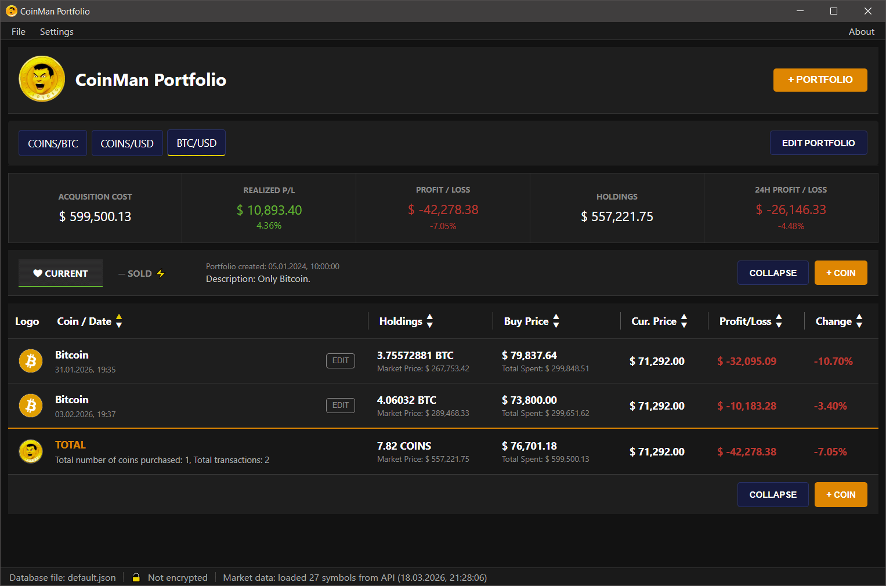
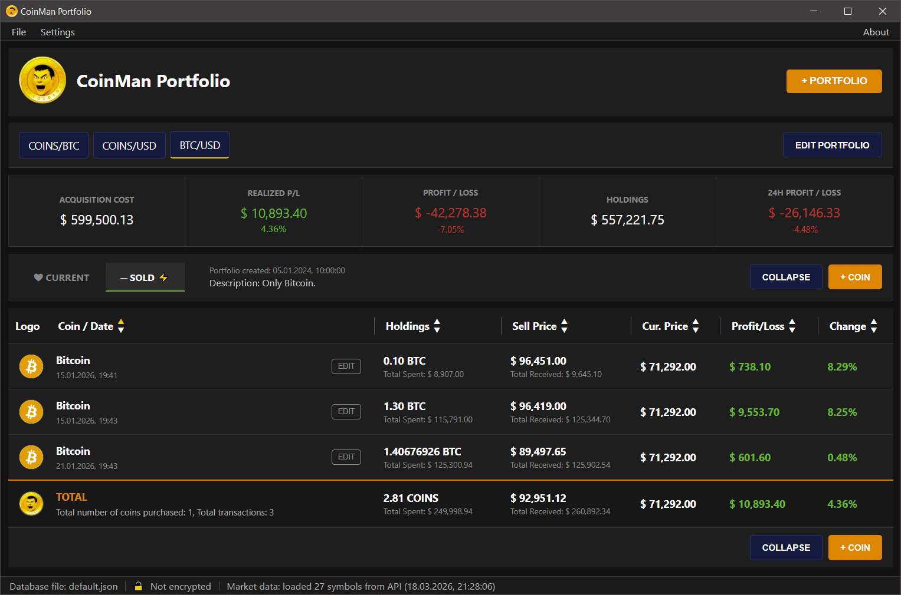

# CoinMan Portfolio Tracker

A desktop cryptocurrency portfolio tracker with integrated swaps, bridges, token approval management, and Yearn Finance vaults. Portfolio databases stay **on your computer**, with optional password encryption and no CoinMan account required.

[](https://github.com/coinman-dev/portfolio/releases)
[](https://github.com/coinman-dev/portfolio/actions/workflows/ci.yml)
[](#)
[](https://tauri.app/)
[](https://github.com/coinman-dev/portfolio/releases)
[](LICENSE)

---

## Why CoinMan?

CoinMan stores your portfolio records locally in JSON databases, with optional encryption. You can track holdings without creating a CoinMan account.

- **Local portfolio storage** — you control your database files
- **No registration** — no account, no email, no phone number
- **Works offline** — prices are fetched on demand, not required
- **Open source** — verify exactly what the app does

Price refreshes, wallet connections, swaps, approval scans, and Earn features need internet access and contact third-party APIs, WalletConnect relays, blockchain RPCs, or embedded services. Those services can receive wallet addresses and request details; blockchain transactions are public.

---

## Features

- Multiple independent portfolios within a single database file
- Add coins with buy price, amount, date, and notes
- Record sells and track realized profit/loss
- Automatic current price fetching via [CoinGecko API](https://www.coingecko.com/) or [CoinMarketCap API](https://coinmarketcap.com/) (configurable)
- P&L display and price change in %
- Switch between multiple database files at runtime
- **AES-256-GCM database encryption** with Argon2id key derivation
- Optional "Current Price" column (toggle in Settings)
- Status bar: loaded database name + market data status
- Configurable column alignment and table totals; pasted numbers accept comma/period separators and spaces
- Daily diagnostic logs, enabled in Settings or with `--debug`
- Window size and position saved between launches

### Exchange

Open the **Exchange** menu to select a module:

- **Best Rate** compares routes from seven services: LI.FI, Bungee/Socket, Relay, KyberSwap, CoW Protocol, deBridge, and NEAR Intents. Results distinguish routes you can execute in the app from routes completed on a service's website. Supports a different recipient address, slippage settings (including 0.25%), and local swap history.
- **Li-Fi** provides a swap and bridge widget, including Tron support.
- **CoW Swap** provides its trading widget and an orders panel.
- **Jumper Exchange** opens `jumper.xyz` inside the app using the selected CoinMan wallet.
- **Approvals** finds and revokes token approvals on 16 EVM networks, Tron, and Solana, with local revoke history. Some EVM networks require a HyperSync API key for approval-history scanning.

In-app Best Rate execution and LI.FI signing include transaction checks. Review the recipient, token amounts, fees, and wallet prompts before signing; route availability depends on the service and network.

### Earn

Open **Earn → Yearn Finance** to browse vaults, search and filter by network, compare vaults, and inspect APY, TVL, strategies, fees, and risk information.

- Deposit and withdraw with actions appropriate to each vault type.
- View wallet holdings, allocation, portfolio history, and activity.
- Work with yvUSD unlocked/locked positions and yBOLD staking.
- Use Enso token zaps where supported and migrate eligible retired vaults.

### Wallets

Use **Exchange → Wallet Connect** or **Earn → Wallet Connect** to connect a hardware, mobile, or desktop wallet through WalletConnect. Several wallets can be saved and connected at once; the selected wallet is shared across Exchange and Earn.

Saved wallets and sessions survive restarts. Switching to a disconnected wallet opens it for viewing balances, Earn positions, and approvals; reconnect it before signing. EVM, Tron, and Solana use separate connections. OneKey EVM pairing requests EVM networks only.

The shared EVM network list includes Ethereum, Arbitrum, Optimism, Polygon, BNB Chain, Base, Avalanche, Katana, Gnosis, Linea, Sonic, Unichain, zkSync, Scroll, Mantle, and Blast. Each exchange or vault may support a smaller subset.

---

## Supported Platforms

| Platform | Status |
|----------|--------|
| Windows 10/11 | ✅ Supported |
| Linux (Ubuntu 22.04+) | ✅ Supported |
| macOS | ✅ Supported |

Download **[v0.8.0-beta](https://github.com/coinman-dev/portfolio/releases/tag/v0.8.0-beta)** from GitHub Releases. This is a prerelease: back up your database before upgrading.

| Platform | Release asset |
|----------|---------------|
| Windows x64 | `coinman-portfolio-windows-x64.zip` — portable executable |
| Linux x64 | `coinman-portfolio-linux-x64.tar.gz` — portable binary |
| macOS Intel | `coinman-portfolio-macos-x86_64.dmg` |
| macOS Apple Silicon | `coinman-portfolio-macos-aarch64.dmg` |

Extract portable builds into a writable folder: the app keeps data and optional logs next to the executable. Linux requires `libwebkit2gtk-4.1-0` on the target machine.

---

## Screenshots

These screenshots show portfolio views from an earlier version; the Exchange and Earn modules are described above.





---

## Building from Source

Install **Rust 1.95.0 or newer** ([via rustup](https://rustup.rs/)). The build scripts under `scripts/` check system packages, the Windows cross-compile toolchain, and Tauri CLI, and prompt before installing missing components (default **Y**).

The repository includes compiled Exchange/Earn bundles, so **Node.js is only required when rebuilding those modules**.

> Both scripts run on Debian/Ubuntu-based hosts: Linux directly, or Windows via WSL.

### Linux portable binary

```bash
git clone https://github.com/coinman-dev/portfolio.git
cd portfolio
bash scripts/build-linux-local.sh v0.8.0-beta
```

Output: `target/release/coinman-portfolio`

> To run on another Ubuntu machine, the package `libwebkit2gtk-4.1-0` must be present on the target system.

### Windows portable `.exe` (cross-compiled from Linux/WSL)

```bash
git clone https://github.com/coinman-dev/portfolio.git
cd portfolio
bash scripts/build-windows-local.sh v0.8.0-beta
```

Output: `target/x86_64-pc-windows-msvc/release/coinman-portfolio.exe`

The script uses [`cargo-xwin`](https://github.com/rust-cross/cargo-xwin), which fetches Microsoft's MSVC SDK on demand (MIT-licensed) — no Windows VM or Visual Studio install required.

### What the scripts do

- Verify prerequisites and offer to install anything missing (`apt`, `rustup target add`, `cargo install`).
- Stamp the binary version from the latest `v*` git tag plus the short HEAD SHA — e.g. `0.8.0-beta-abcdef0` — so the version shown in the desktop UI uniquely identifies the build.
- Accept a specific tag as a version argument: `bash scripts/build-linux-local.sh v0.8.0-beta`. The script builds the current checkout; this argument does not check out the tag.
- Restore the working tree after the build via a `trap`, even on failure or Ctrl+C.

### Development mode

Development takes place on **`dev`**; **`main`** contains merged release changes. For hot-reload dev iteration:

```bash
cd portfolio
git switch dev
cargo tauri dev
```

Run the relevant build script once beforehand — it installs the same system packages and Tauri CLI that `cargo tauri dev` needs.

To edit Exchange/Earn modules, install Node.js and rebuild the React/TypeScript bundle:

```bash
cd modules/widgets
npm ci
npx tsc --noEmit
npm run build
```

Commit updated bundles in `frontend/modules/` and `frontend/exchange/` together with module source changes. See [modules/README.md](modules/README.md) for the module layout.

Backend validation:

```bash
cargo test --manifest-path src-tauri/Cargo.toml --locked
```

CI runs inexpensive JavaScript/manifest checks on relevant `main` pushes and full Linux backend tests on ready PRs or manual dispatch. Release tags build Windows, Linux, macOS Intel, and macOS Apple Silicon; manual packaging defaults to Windows only. Tags with a suffix such as `-beta` publish prereleases. See [AGENTS.md](AGENTS.md) for the Actions budget policy.

---

## Database File

By default, portfolio data is saved to `data/base/default.json` next to the executable. You can create multiple databases and switch between them via **File → Open database file**, or copy a database via **File → Save database as...**.

| Path next to the executable | Contents |
|----------------------------|----------|
| `data/base/*.json` | Portfolio databases |
| `data/settings.json` | Application and module preferences |
| `data/cache.json` | Cached market data |
| `data/wallets.json` | Saved wallets and WalletConnect sessions, including session keys |
| `data/exchange-history.json` | Best Rate swap history |
| `data/revoke-history.json` | Approval revoke history |
| `data/jumper-storage.json` | Persisted Jumper preferences |
| `Logs/coinman-YYYY-MM-DD.log` | Daily diagnostic logs, when enabled |

Older `database/` and `settings-cache.json` layouts are migrated automatically. The main webview profile is temporary and removed on normal exit; wallets and selected preferences persist through the files above.

Database encryption protects the selected portfolio database. It does **not** encrypt settings, API keys, wallet session storage, histories, or logs. Keep those files private.

Enable **Settings → Debug mode (write log files)** and use **Settings → Open logs folder** to inspect logs. Launching with `--debug` enables logging and DevTools for that session. Logging is disabled by default.

---

## Price Source

By default, CoinMan fetches live prices from the **CoinGecko API** (no API key required).

Optionally, you can switch to **CoinMarketCap** as the price source:

1. Select **Settings → Fetch prices from CoinMarketCap**
2. Enter your CMC API key (free tier available at [coinmarketcap.com](https://coinmarketcap.com/api/))
3. The key is validated immediately — if valid, CMC becomes the active price source
4. The status bar shows `from CMC` or `from CG` to indicate which source was last used

If the CMC API key fails or is revoked, the app automatically falls back to CoinGecko.

---

## Database Encryption

CoinMan Portfolio Tracker supports **AES-256-GCM** encryption for database files, with keys derived via **Argon2id** (memory-hard key derivation). Your data is protected with modern, battle-tested cryptography.

### How it works

- Go to **File → Encrypt database** to set a password for the current database file
- The encrypted file is stored in-place — the same `.json` path, but the contents are encrypted
- On next launch (or when switching to an encrypted database), you will be prompted for the password
- Without the correct password, the file cannot be read or decrypted

### Key details

| Property | Value |
|----------|-------|
| Cipher | AES-256-GCM |
| Key derivation | Argon2id |
| KDF parameters | m=65536 (64 MB), t=2 iterations, p=1 |
| Salt | 16 bytes, randomly generated per encryption |
| Nonce | 12 bytes, randomly generated per encryption |

### Password management

- **Change password** — File → Change database password (re-encrypts with a new key)
- **Remove encryption** — File → Decrypt database (restores to plain JSON)
- The password is never stored anywhere — it is held in memory only for the current session

> **Important:** If you forget your password, there is no recovery option. Keep your password safe.

---

## Tech Stack

- [Tauri v2](https://tauri.app/) (2.11.x) — desktop app framework (Rust + WebView)
- Rust (MSRV 1.95.0) — backend, data storage, system calls
- Vanilla JavaScript / HTML / CSS — portfolio UI and application shell
- React / TypeScript / Vite — Exchange and Earn modules (Node.js/npm for module development)
- WalletConnect / wagmi / viem — wallet connections and blockchain interaction
- LI.FI, CoW Protocol, and other route providers — swaps and bridges
- Yearn yDaemon / Kong — vault data; Enso — token zaps
- Python 3 — used only by maintainer-side scripts under `scripts/catalog/` for coin catalog updates (not needed to run or build the app)
- [CoinGecko API](https://www.coingecko.com/) — live coin prices (default)
- [CoinMarketCap API](https://coinmarketcap.com/) — live coin prices (optional, requires API key)
- [CoinMarketCap](https://coinmarketcap.com/) — coin catalog & logos

---

## Built with AI

This project was developed with the help of AI tools:
- [ChatGPT](https://chat.openai.com/)
- [Google Gemini](https://gemini.google.com/)
- [Claude (Anthropic)](https://claude.ai/)

---

## Disclaimer

CoinMan Portfolio Tracker is provided **for informational purposes only**. It is not financial, investment, or trading advice. Swaps, bridges, approvals, and vault deposits interact with third-party services and smart contracts and carry risks. The authors are not responsible for financial decisions or losses. Use at your own risk.

---

## Data Attribution

Market price data is provided by the [CoinGecko API](https://www.coingecko.com/) (default) or the [CoinMarketCap API](https://coinmarketcap.com/) (optional). CoinMan Portfolio Tracker is not affiliated with or endorsed by CoinGecko or CoinMarketCap.

Coin catalog data (names, symbols, IDs) and coin logos are provided by [CoinMarketCap](https://coinmarketcap.com/). CoinMan Portfolio Tracker is not affiliated with or endorsed by CoinMarketCap.

Exchange and Earn data comes from the integrated providers and protocols. CoinMan Portfolio Tracker is not affiliated with or endorsed by these providers.

---

## License

This project is licensed under the [MIT License](LICENSE).
